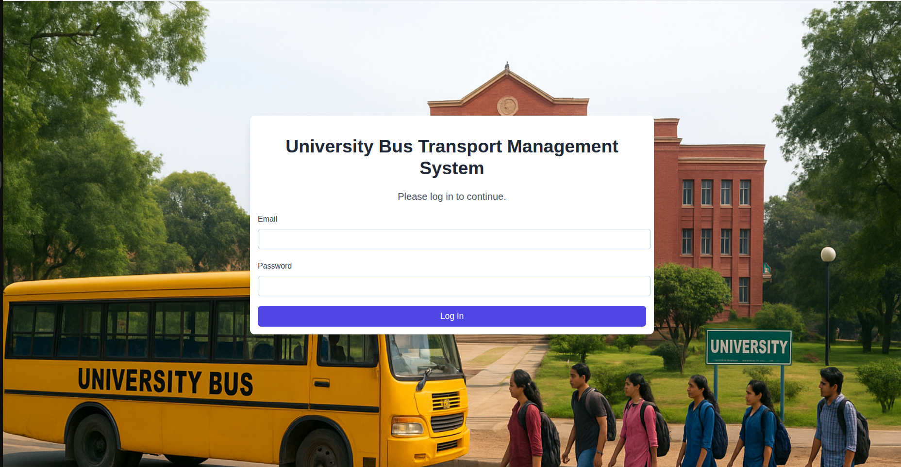
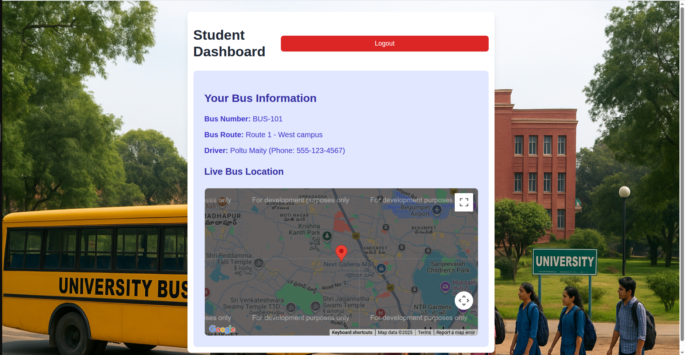
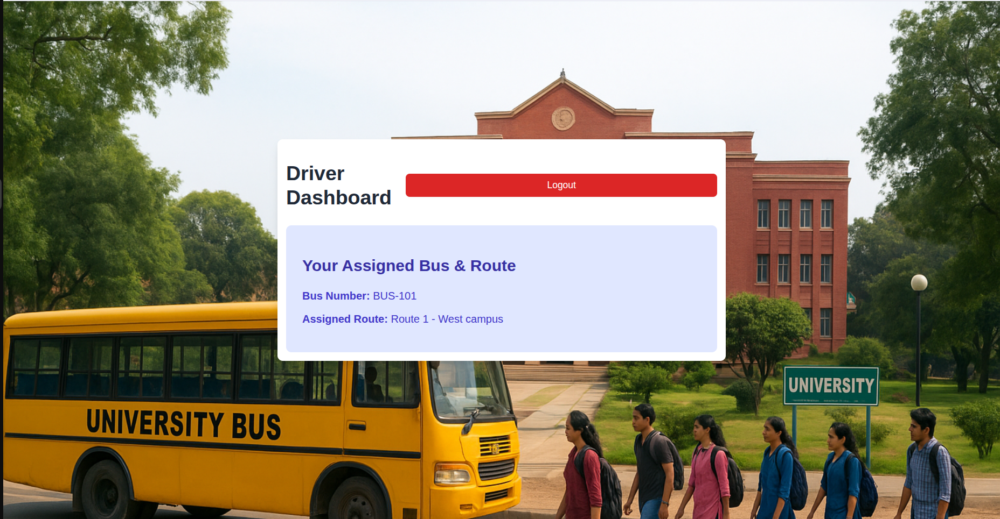
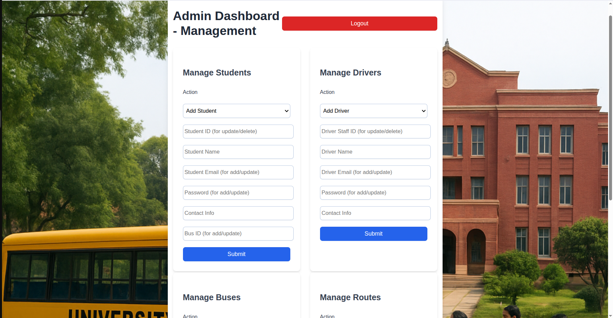

# University Bus Transport Management System

A **web-based system** for managing and tracking university buses.
This project provides role-based dashboards for **Students, Drivers, and Admins** with live bus location tracking, bus assignments, and management features.

---

## Features

###  Student Dashboard
- Login with credentials
- View assigned bus details
- Track **live bus location** on Google Maps
- See driver contact information

### Driver Dashboard
- View assigned bus and route information

### Admin Dashboard
- Manage Students (Add / Update / Delete)
- Manage Drivers
- Manage Buses
- Manage Routes

---

## Tech Stack
- **Frontend:** HTML, CSS, JavaScript 
- **Backend:** Node.js, Express.js 
- **Database:** MySQL 
- **Maps Integration:** Google Maps API 

---


## Setup Instructions

### Clone the Repository
```bash
	git clone https://github.com/your-username/university-bus-transport.git
	cd university-bus-transport
```
### Install Dependencies

```
npm install express mysql2
```
### Import the Database

 Create a MySQL database (e.g., bus_management)

 Import the schema:
```
mysql -u root -p bus_management < schema.sql
```

### Configure Database Connection

 In server1.js, update the MySQL credentials:
 
```js
const db = mysql.createConnection({
    host: 'localhost',
    user: 'root',
    password: 'your_password',  
    database: 'bus_management'
});
```
### Run the Server 
```
node server.js
```
### Server will start at:

 http://localhost:5500 using this link.

## Screenshot

### Login Page



### Student Dashboard 



### Driver Dashboard



### Admin Dashboard



